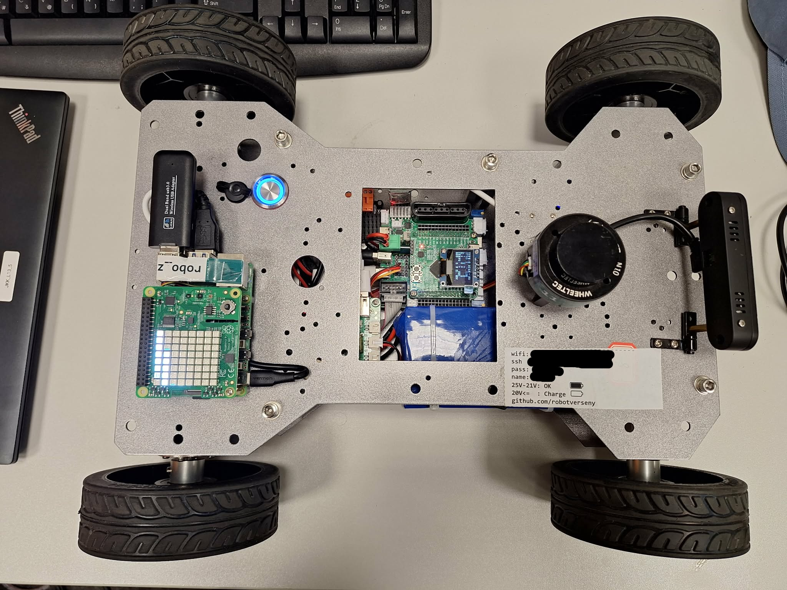

# Robot irányítás lidar segítségével iskolai projekthez
ROS 2 c++ package [](https://docs.ros.org/en/humble/)
## Telepítés

Munkakönyvtár: `~/ros2_ws/`.

### Klónozás:

```bash
cd ~/ros2_ws/src
```
```bash
git clone https://github.com/barna154/way_finder
```
### ros2 könyvtár telepítés

```bash
cd ~/ros2_ws
```
```bash
colcon build --packages-select way_finder --symlink-install
```

### könytár futtatása

```bash
source ~/ros2_ws/install/setup.bash
```

```bash
ros2 launch way_finder start.launch.py
```

## Tesztelés
### A tesztelő környezet az alábbi linken található: 
#### https://github.com/robotverseny/robotverseny_gazebo24/


## Bemutatott projekt
### A projekthez egy WheelTec rosbot mini volt használva



## Forrás
A projekt a https://github.com/robotverseny/megoldas_sim24 Follow the Gap típúsú megoldása alapján készült.
